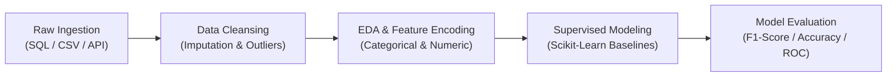

> [!NOTE]
> **National Occupational Program Metadata**:
> - **Authority**: Kementerian Komunikasi dan Digital RI (Komdigi) — Digital Talent Academy (DEX)
> - **Scheme**: Standar Kompetensi Kerja Nasional Indonesia (SKKNI) — **Ilmuwan Data Muda (Associate Data Scientist)**
> - **Official Program Portal**: [`s.komdigi.go.id/associate-data-scientist`](https://s.komdigi.go.id/associate-data-scientist)
> - **Status**: **100% Curriculum & Practical Competency Completed** (Awaiting administrative certificate release)

---

## 01. National Curriculum & SKKNI Alignment

The **Associate Data Scientist + Python - Nasional** program is an official occupational track established by Komdigi aligned with the **National Agency for Professional Certification (BNSP)**.

It provides rigorous standardization for data practitioners in data manipulation, feature engineering, and predictive modeling using modern Python ecosystems (`Pandas`, `NumPy`, `Scikit-Learn`, `Seaborn`).

---

## 02. 12 SKKNI Competency Unit Coverage

| Unit Category | Unit ID / Title | Technical Python Stack | Evidence Deliverable |
| :--- | :--- | :--- | :--- |
| **Ingestion** | UK 01: Mengumpulkan Data | `requests`, `sqlite3`, `pd.read_sql` | Multi-source ingestion & data schema validator script. |
| **Diagnostics** | UK 02: Menelaah Data | `df.describe()`, `seaborn.heatmap` | Full EDA statistical notebook with outlier analysis. |
| **Cleansing** | UK 03: Membersihkan Data | `df.fillna()`, `IQR clipping`, `StandardScaler` | Modular automated cleaning pipeline. |
| **Labeling** | UK 04: Menentukan Label Data | `OneHotEncoder`, `train_test_split(stratify=y)` | Machine learning-ready training & test partitions. |
| **Modeling** | UK 05–08: Pemodelan Data | `LogisticRegression`, `RandomForest`, `DecisionTree` | Cross-validated model evaluation report (ROC, F1). |
| **Scraping & Annotation** | UK 09–12: Web Data & Assessment | `BeautifulSoup4`, Annotation Schemas | Web scraping script & perfect final assessment score. |

---

## 03. End-to-End Architectural Pipeline

---

> [!IMPORTANT]
> **Operational Status**: All 12 unit modules and final assessment quizzes are 100% completed. Certificate issuance is in administrative processing by Komdigi.
