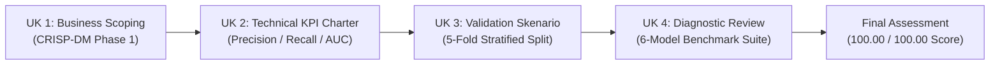

> [!NOTE]
> **National Examination Scorecard**:
> - **Authority**: Kementerian Komunikasi dan Digital RI (Komdigi) — Course ID: `1629`
> - **Standard**: **SKKNI Nomor 299 Tahun 2020 (Bidang Keahlian Data Science)**
> - **Overall Score**: **100.00 / 100.00 (PERFECT GRADE)**
> - **Status**: **All Units Completed & Passed with Distinction**

---

## 01. Examination Results & Performance Breakdown

| Unit Kompetensi / Assessment | SKKNI Unit Code | Score Achieved | Status |
| :--- | :---: | :---: | :---: |
| **UK 1: Menentukan Objektif Bisnis (CRISP-DM)** | `J.62DSI00.001.1` | **100.00 / 100.00** | 🟢 **Passed (Perfect)** |
| **UK 2: Menentukan Tujuan Teknis Data Science** | `J.62DSI00.002.1` | **100.00 / 100.00** | 🟢 **Passed (Perfect)** |
| **UK 3: Membangun Skenario Model** | `J.62DSI00.003.1` | **100.00 / 100.00** | 🟢 **Passed (Perfect)** |
| **UK 4: Melakukan Proses Review Pemodelan** | `J.62DSI00.004.1` | **90.00 / 100.00** | 🟢 **Passed** |
| **FINAL ASSESSMENT DATA SCIENTIST** | `SKKNI 299/2020` | **100.00 / 100.00** | 🟢 **PERFECT SCORE** |

---

## 02. CRISP-DM National Methodology

---

## 03. Core Capabilities Validated

1. **CRISP-DM Business Translation**: Deconstructing executive problems into quantitative machine learning experiments.
2. **Reproducible Validation Pipelines**: Implementing strict 5-fold cross-validation preventing data leakage.
3. **Multi-Model Benchmark Diagnostics**: Rigorous diagnostic comparison across Logistic Regression, Random Forest, XGBoost, and Gradient Boosting.
4. **ROC-AUC & Error Distribution Analysis**: Evaluating threshold sensitivity and commercial cost-of-misclassification tradeoffs.

---

> [!IMPORTANT]
> **Status**: Examination requirements completed with perfect marks. Formal administrative certificate release pending from Komdigi.
