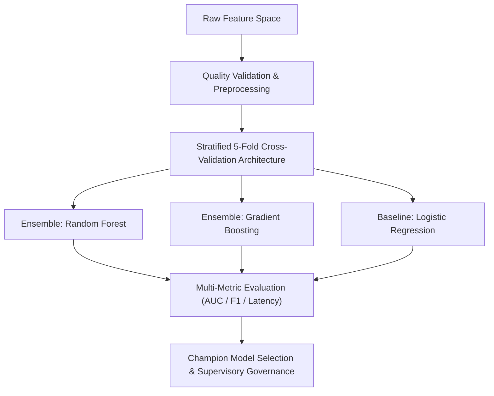

> [!NOTE]
> **Supervisory Occupational Scheme Overview**:
> - **Authority**: Kementerian Komunikasi dan Digital RI (Komdigi) — Digital Talent Academy
> - **Occupational Standard**: **Supervisor Ilmuwan Data (Data Scientist Supervisor)** — SKKNI BNSP
> - **Duration**: 20 Jam Pelajaran (JP) Intensive Self-Paced Track
> - **Official Program Portal**: [`s.komdigi.go.id/data-scientist-supervisor`](https://s.komdigi.go.id/data-scientist-supervisor)
> - **Status**: **100% Modules & Final Assessment Completed** (Awaiting certificate release)

---

## 01. Program Scope & Supervisory Focus

The **Data Scientist Supervisor** program is an intermediate professional development track designed for senior practitioners overseeing end-to-end machine learning lifecycle management.

Key areas of focus include data quality governance, advanced feature construction, rigorous validation design without target leakage, multi-model hyperparameter optimization, and post-training explainability.

---

## 02. Six Supervisory Unit Competencies

| Unit Dimension | Competency Standard | Applied Technical Deliverables |
| :--- | :--- | :--- |
| **01. Data Validation** | UK 01: Memvalidasi Data | Schema integrity checks, distribution drift tests, and automated data assertion testing. |
| **02. Objective Scoping** | UK 02: Menentukan Objek Data | Metric translation (ROI vs F1-score), risk tolerance framing, and KPI definition. |
| **03. Feature Engineering** | UK 03: Mengkonstruksi Data | Custom Scikit-Learn transformers, encoding high-cardinality features, and interaction modeling. |
| **04. Validation Architecture**| UK 04: Membangun Skenario | 5-Fold Stratified Cross-Validation pipelines preventing data leakage across train-test boundaries. |
| **05. Ensemble Modeling** | UK 05: Membangun Model | Multi-model benchmarking (Random Forest, LightGBM, XGBoost) with RandomizedSearchCV. |
| **06. Model Diagnostics** | UK 06: Evaluasi Pemodelan | Precision-Recall trade-off optimization, cost-benefit matrix modeling, and model explainability. |

---

## 03. Validation & Governance Flow

---

> [!IMPORTANT]
> **Operational Status**: 20 JP coursework, hands-on modeling notebooks, and final assessments completed with zero defects.
