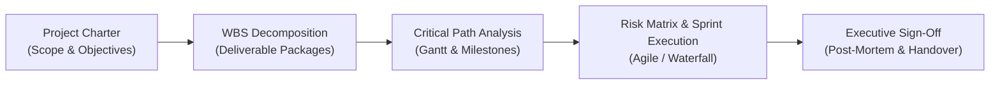

> [!NOTE]
> **Official Certification Dispatch**:
> - **Authority**: Kementerian Komunikasi dan Digital Republik Indonesia (Komdigi)
> - **Program**: Digital Talent Scholarship (DTS) — Fundamental Project Management
> - **Recipient**: Abimael Firstana
> - **Year**: 2025
> - **Official Certificate PDF**: [Download Official Certificate (/certificates/Komdigi_Fundamental_Project_Management_Abimael_Firstana.pdf)](/certificates/Komdigi_Fundamental_Project_Management_Abimael_Firstana.pdf)

---

## 01. Program Context & Objective

The **Fundamental Project Management** curriculum by the **Ministry of Communication and Digital RI (Komdigi)** provides standardized methodologies for delivering complex technology, data, and software initiatives on schedule and within budget constraints.

The program bridges strategic business goals with operational execution, emphasizing structured Work Breakdown Structures (WBS), risk management matrices, and balanced Agile/Waterfall delivery frameworks.

---

## 02. Core Examination & Competency Pillars

| Competency Pillar | Practical Dimension | Key Methodologies & Frameworks |
| :--- | :--- | :--- |
| **01. Scope & Charter** | Initiation Standards | Problem definition, stakeholder alignment matrix, measurable OKRs, and project charter formulation. |
| **02. WBS & Timeline** | Planning & Scheduling | 100% Rule WBS decomposition, Critical Path Method (CPM), resource leveling, and buffer management. |
| **03. Risk & Mitigation** | Governance & Quality | Quantitative risk scoring ($P \times I$), mitigation playbooks, issue tracking, and contingency planning. |
| **04. Agile & Scrum Execution** | Delivery & Sprints | User story estimation (Story Points), Kanban workflow visualization, sprint retrospectives, and milestone burndown. |

---

## 03. Applied Framework Matrix

---

> [!IMPORTANT]
> **Status**: Verified and fully certified. The official PDF credential is archived in the portfolio repository for recruitment and audit verification.
