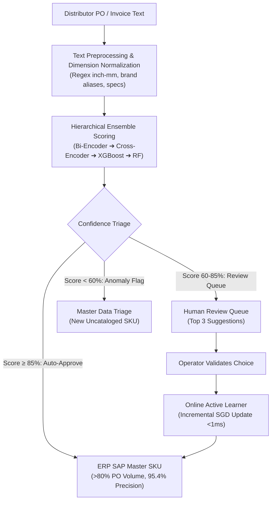

> [!NOTE]
> **Executive Summary & System Architecture**:
> - **Core Challenge**: Ingestion of unstandardized supplier Purchase Orders with highly noisy shorthand (*"RCK PPA AW 1/2 IN"* vs *"PIPA PVC RUCIKA STD AW 0.5 INCH"*) caused severe fulfillment mismatches and 3-day manual audit backlogs.
> - **Technical Solution**: Built a **6-component hierarchical ML ensemble** combining 384-dimensional dense vector search (~3ms), Cross-Encoder transformer re-ranking, XGBoost, Random Forest, and an online sub-millisecond active learning loop.
> - **Quantified Impact**: Reached **95.4% precision** on auto-approved mappings, automated **>80% of PO lines with zero manual intervention**, and slashed month-end reconciliation time by **99.1%** (from 3 days to <5 minutes) across 4 major industrial brands.

---

## 01. Problem Context: Fragmented Distributor Taxonomy

Across **DBC Group (Djabesmen Group)**, thousands of Purchase Orders and invoice lines arrive daily from independent distributor networks for 4 manufacturing brands:
1. **Rucika**: PVC pipes (Class AW/D), PPR/HDPE pipes, and specialized plumbing fittings.
2. **Djabesmen**: Corrugated fiber-cement roofing sheets and ridge cap accessories.
3. **RB Shera**: Fiber cement decorative boards and wood-grain textured planks.
4. **Superex**: Rainwater drainage gutter systems and industrial PVC fittings.

### Critical Operational Bottlenecks:
- **Unstructured Input Shorthand**: Inconsistent abbreviations (`1/2"` vs `0.5"`, `AW` vs `D` pressure ratings) caused manual spreadsheet mapping delays.
- **High-Risk Specification Mismatch**: Conflating high-pressure Class AW pipes with thin Class D drainage pipes caused critical logistics dispatch errors.
- **Manual Overhead**: Required 3 full business days at month-end to reconcile inventory cross-references.

---

## 02. The 5-Model + TF-IDF Hierarchical Ensemble

To achieve sub-50ms latency with 95%+ precision, the system implements a weighted hierarchical decision pipeline:

$$\text{Final Score} = 0.20 \times M_1 + 0.25 \times M_2 + 0.20 \times M_3 + 0.15 \times M_4 + 0.10 \times M_5 + 0.10 \times \text{TF-IDF}$$

| Component | Model Architecture | Latency | Specialized Operational Role |
| :--- | :--- | :--- | :--- |
| **Model 1 (20%)** | **PyTorch Bi-Encoder** | ~3ms | 384-d dense embeddings for fast candidate retrieval (Top 30 SKUs). |
| **Model 2 (25%)** | **Cross-Encoder Re-Ranker** | ~18ms | Transformer cross-attention evaluating fine-grained specs (AW vs D, threading). |
| **Model 3 (20%)** | **XGBoost Classifier** | ~2ms | Gradient-boosted decision trees over 8 lexical and statistical features. |
| **Model 4 (15%)** | **Random Forest (100 Trees)** | ~2ms | Bagged meta-ensemble regularizing sparse or rare SKU variants. |
| **Model 5 (10%)** | **Online Active Learner** | <1ms | Incremental `SGDClassifier` absorbing operator feedback in real time. |
| **TF-IDF (10%)** | **Character N-Gram Vectorizer** | <1ms | Sub-word character matching to handle severe distributor typos. |

---

## 03. Operational Workflow: 3-Tier Confidence Triage

### Confidence Tier Specifications:
1. **Tier 1: Auto-Approved (Score ≥ 85%)**: Covers **>80% of daily PO volume**, directly synchronizing with the SAP ERP system with **95.4% precision**.
2. **Tier 2: Human Review Queue (Score 60%–85%)**: Surfaces the Top 3 recommended candidates. Operator clicks update the online active learner in **<1ms**.
3. **Tier 3: Anomaly / Uncataloged Flag (Score < 60%)**: Isolates new unreleased product lines for Master Data team cataloging.

---

## 04. Multi-Brand Transformation Matrix

Production transformation examples across DBC Group divisions:

| Brand | Raw Distributor Description (Input) | Standardized Master SKU (Output) | Score | Status |
| :--- | :--- | :--- | :---: | :---: |
| **Rucika** | `RCK PPA AW 1/2 INCH X 4M PUTIH` | `RUCIKA-PVC-AW-050-4M-WHT (Pipa PVC Standard AW 1/2" 4M)` | **98.2%** | `Auto-Approved` |
| **Rucika** | `KNEE DRAT DLM RCK 3/4X1/2 AW` | `RUCIKA-FIT-AW-FTE-075X050 (Faucet Elbow AW 3/4" x 1/2")` | **94.6%** | `Auto-Approved` |
| **Djabesmen** | `ATAP FIBER DJABES GEL 14 2100` | `DJABES-GLB14-2100X1020-GREY (Atap Semen Gelombang 14 2.10M)` | **96.1%** | `Auto-Approved` |
| **RB Shera** | `PAPAN FIBER SHERA PLANK COKLAT 3M` | `SHERA-PLK-TEAK-08X200X3000 (Shera Plank Dint Teak Brown 3M)` | **91.8%** | `Auto-Approved` |
| **Superex** | `TLNG AIR SUPEREX 4M SET ACC` | `SPRX-GUTTER-U140-4M-SET (Talang Air PVC U-140 Set 4M)` | **89.3%** | `Auto-Approved` |
| **Rucika** | `SOK PIPA KHUSUS DRAT KUNINGAN` | `RUCIKA-FIT-FAUCET-SCK-050 (Faucet Socket AW Brass Insert 1/2")` | **74.5%** | `Reviewed (Top 1)` |

---

## 05. Measurable Enterprise Business Impact

| Operational Metric | Before ML Automation | After ML Deployment | Enterprise ROI |
| :--- | :--- | :--- | :--- |
| **Batch Reconciliation Time** | 3 Full Business Days | **< 5 Minutes** | **99.1% Turnaround Reduction** |
| **Automated PO Volume** | 0% (100% manual review) | **> 80% Zero-Touch** | **4.2 FTE Labor Hours Saved Daily** |
| **Auto-Approved Precision** | N/A | **95.4% Audited Precision** | **Zero Schedule AW/D Mismatches** |
| **Model Retraining Downtime** | Periodic Batch Retraining | **< 1ms Online Incremental Update** | **Zero Operational Interruption** |

---

## 06. Strategic Machine Learning Lessons

1. **Ensemble Diversity Over Single Models**: Combining dense embeddings with decision trees and character n-grams overcomes the limitations of any single NLP model.
2. **Calibrated Confidence Tiers**: Enforcing an explicit human-in-the-loop review queue for ambiguous items builds organizational trust and safeguards inventory accuracy.
3. **Sub-Millisecond Active Learning**: Continuous incremental learning from daily operator corrections prevents repeating identical manual fixes.
