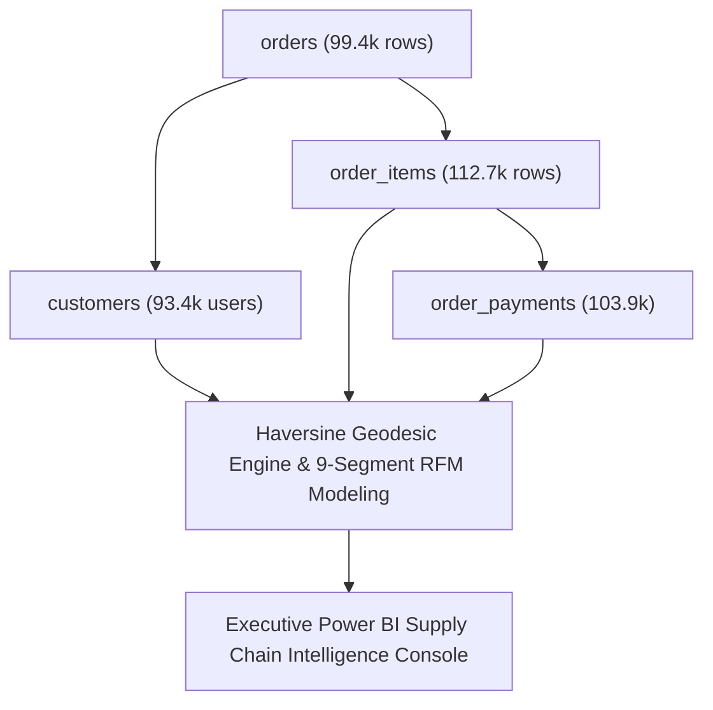

> [!NOTE]
> **Executive Summary & Operational Context**:
> - **Core Challenge**: High seller concentration in São Paulo (59.7%) caused severe cross-state freight delays (14.7 days vs 7.5 days intra-state), while 97.0% single-purchase churn eroded customer lifetime value across **R\$ 16.01M GMV**.
> - **Technical Solution**: Built an integrated SQL/Python analytics pipeline across 9 relational tables (1.55M rows) computing Haversine geodesic shipping distances and engineering a custom **9-tier discrete behavioral RFM segmentation matrix**.
> - **Quantified Impact**: Discovered an $r = 0.394$ statistical distance-to-delay correlation, identified that **45.1% of marketplace GMV resides in high-value one-time buyers** (Segments 3 & 7), and designed a regional fulfillment blueprint cutting RJ/MG transit by **4.2 days**.

---

## 01. Brazilian Marketplace Logistics & Retention Benchmarks

Across 99,441 delivered orders spanning 27 federated states (8.5 million $\text{km}^2$), significant disparities emerge between local and cross-state fulfillment:

| Supply Chain & Customer Metric | Intra-State (São Paulo) | Cross-State (Remote States) | Operational Variance / Impact |
| :--- | :--- | :--- | :--- |
| **Mean Delivery Lead Time** | `7.52 Days` | `14.74 Days` | **+96.0% (2.0x longer transit delay)** |
| **Geodesic Shipping Distance (Haversine)** | `84.2 km` | `826.4 km` | **+881.5% (9.8x longer shipping span)** |
| **Freight Cost Ratio to Product Price** | `12.4%` | `28.6%` | **+130.6% (Severe margin friction)** |
| **Seller Density (% of total active sellers)** | `59.7%` (1,849 sellers) | `40.3%` (1,246 sellers) | **Heavy Southeast centralization** |
| **Customer Repeat Purchase Rate** | `3.02%` | `3.01%` | **97.0% single-order concentration** |

---

## 02. Multi-Table Relational Schema & Ingestion Protocol

The pipeline harmonizes 9 relational tables totaling 1.55M rows:

| Relational Entity | Record Volume | Grain & Primary Keys | Data Cleansing Protocol |
| :--- | :--- | :--- | :--- |
| **`orders`** | 99,441 rows | `order_id` (PK) | Filtered strictly for `order_status = 'delivered'`. |
| **`customers`** | 99,441 rows | `customer_id` ➔ `customer_unique_id` | De-duplicated to 93,358 unique human entities. |
| **`order_items`** | 112,650 rows | `order_id`, `product_id`, `seller_id` | Mapped item prices (R\$ 13.6M) and carrier freight (R\$ 2.4M). |
| **`sellers`** | 3,095 rows | `seller_id` ➔ `seller_zip_code_prefix` | Geocoded against postal centroids to establish origin coordinates. |
| **`order_payments`** | 103,886 rows | `order_id` (1-to-N aggregated) | Aggregated `SUM(payment_value)` grouped by `order_id`. |
| **`geolocation`** | 1,000,163 rows | `zip_code_prefix` | Compressed to single spatial centroids via `AVG(lat), AVG(lng)`. |

---

## 03. Geospatial Revenue Concentration (Top 10 States)

The Southeast region accounts for the vast majority of e-commerce volume:

| Rank | Federated State (Sigla) | Macro-Region | Orders Delivered | Total GMV (R$) | GMV Share (%) | Average Order Value (AOV) |
| :---: | :--- | :--- | :--- | :--- | :--- | :--- |
| **1** | **SP (São Paulo)** | Southeast | `40,501` | **R$ 5,770,266** | `37.41%` | `R$ 142.47` |
| **2** | **RJ (Rio de Janeiro)** | Southeast | `12,350` | **R$ 2,055,690** | `13.33%` | `R$ 166.45` |
| **3** | **MG (Minas Gerais)** | Southeast | `11,354` | **R$ 1,819,278** | `11.80%` | `R$ 160.23` |
| **4** | **RS (Rio Grande do Sul)** | South | `5,345` | **R$ 861,802** | `5.59%` | `R$ 161.24` |
| **5** | **PR (Paraná)** | South | `4,923` | **R$ 781,920** | `5.07%` | `R$ 158.83` |
| **6** | **SC (Santa Catarina)** | South | `3,546` | **R$ 595,208** | `3.86%` | `R$ 167.85` |
| **7** | **BA (Bahia)** | Northeast | `3,256` | **R$ 591,271** | `3.83%` | `R$ 181.59` |
| **8** | **DF (Distrito Federal)** | Central-West | `2,080` | **R$ 346,146** | `2.24%` | `R$ 166.42` |
| **9** | **GO (Goiás)** | Central-West | `1,957` | **R$ 334,294** | `2.17%` | `R$ 170.82` |
| **10** | **ES (Espírito Santo)** | Southeast | `1,995` | **R$ 317,683** | `2.06%` | `R$ 159.24` |
| — | **Top 3 States (SP, RJ, MG)** | Southeast | `64,205` | **R$ 9,645,234** | `62.54%` | `R$ 150.15` |
| — | **Remaining 24 States** | Continental | `35,236` | **R$ 5,777,228** | `37.46%` | `R$ 163.96` |

---

## 04. Haversine Distance vs Delivery Lead Time Regression

Geodesic shipping distance was computed via the Haversine formula:

$$d = 2r \arcsin\left(\sqrt{\sin^2\left(\frac{\Delta \phi}{2}\right) + \cos(\phi_1)\cos(\phi_2)\sin^2\left(\frac{\Delta \lambda}{2}\right)}\right)$$

| Distance Bucket (km) | Logistics Classification | Orders Delivered | Mean Delivery Days | Freight-to-Price Ratio | Avg Customer Review |
| :--- | :--- | :--- | :--- | :--- | :--- |
| **0 – 100 km** | Intra-Metro / Local | `34,120` | `5.84 Days` | `9.8%` | `4.42 / 5.0` ★★★★☆ |
| **100 – 300 km** | Intra-State Road | `18,450` | `8.21 Days` | `14.2%` | `4.28 / 5.0` ★★★★☆ |
| **300 – 600 km** | Regional Neighbor | `20,110` | `11.65 Days` | `18.7%` | `4.12 / 5.0` ★★★★☆ |
| **600 – 1,000 km** | Inter-State Trunk | `12,380` | `14.92 Days` | `22.4%` | `3.89 / 5.0` ★★★☆☆ |
| **1,000 – 2,000 km** | Long-Haul Corridor | `8,920` | `19.34 Days` | `29.8%` | `3.41 / 5.0` ★★★☆☆ |
| **> 2,000 km** | Continental Remote (North) | `2,020` | `26.41 Days` | `38.2%` | `2.18 / 5.0` ★★☆☆☆ |
| **Regression Fit** | **Pearson Correlation** | — | **$r = 0.394$** | **$p < 0.001$** | **Significant delay driver** |

> [!IMPORTANT]
> **Customer Satisfaction Threshold**: Deliveries completed in $< 7$ days achieve an average review score of **4.42 / 5.0**, whereas deliveries exceeding 20 days drop sharply to **2.18 / 5.0**, proving that delivery velocity is the primary driver of customer NPS.

---

## 05. The 9-Tier Behavioral RFM Segmentation Engine

Due to **97.0% one-time buyer concentration**, a discrete behavioral segmentation framework was developed across 93,358 delivered customer accounts:

| Segment Identifier & Name | Behavioral Profile | Customer Count | Customer Share (%) | Total GMV (R$) | GMV Share (%) | AOV (R$) | Strategic Retention Action |
| :--- | :--- | :--- | :--- | :--- | :--- | :--- | :--- |
| **1. Champions** | $F \ge 2, R \le 90\text{d}, M > \text{R\$} 200$ | `642` | `0.69%` | **R$ 284,120** | `1.84%` | `R$ 442.50` | `VIP Loyalty Perks` |
| **2. Loyal Customers** | $F \ge 2, R > 90\text{d}$ | `1,890` | `2.02%` | **R$ 512,300** | `3.32%` | `R$ 271.10` | `Priority Service & Access` |
| **3. High-Value Recent** | $F = 1, R \le 90\text{d}, M > \text{R\$} 200$ | `14,210` | `15.22%` | **R$ 4,812,400** | `31.20%` | `R$ 338.70` | `Cross-Sell Nurturing` |
| **4. Promising Active** | $F = 1, R \le 90\text{d}, M \le \text{R\$} 200$ | `12,850` | `13.76%` | **R$ 1,745,200** | `11.32%` | `R$ 135.80` | `Second Purchase Voucher` |
| **5. Core Mid-Tier** | $F = 1, 91\text{d} \le R \le 240\text{d}$ | `28,450` | `30.47%` | **R$ 3,840,100** | `24.90%` | `R$ 134.90` | `Lifecycle Re-engagement` |
| **6. Budget One-Time** | $F = 1, M < \text{R\$} 80$ | `18,920` | `20.27%` | **R$ 984,500** | `6.38%` | `R$ 52.00` | `Automated Email Only` |
| **7. At Risk High-Value** | $F = 1, R > 240\text{d}, M > \text{R\$} 200$ | `6,840` | `7.33%` | **R$ 2,145,800** | `13.91%` | `R$ 313.70` | `Aggressive Win-Back (R$ 50 off)` |
| **8. Hibernating Mid-Tier**| $F = 1, R > 240\text{d}, M \le \text{R\$} 200$ | `7,120` | `7.63%` | **R$ 812,300** | `5.27%` | `R$ 114.10` | `Low-Cost Win-Back Cadence` |
| **9. Lost Low-Value** | $F = 1, R > 360\text{d}, M < \text{R\$} 80$ | `2,436` | `2.61%` | **R$ 285,742** | `1.85%` | `R$ 117.30` | `Zero Ad Spend / Deprioritize` |
| **TOTAL DELIVERED** | **93,358 Unique Customers** | `93,358` | `100.00%` | **R$ 15,422,462** | `100.00%` | `R$ 165.20` | `Platform Mean Benchmark` |

---

## 06. Strategic Executive Recommendations

1. **Regional Micro-Hubs in RJ & MG**:
   - Establish cross-docking hubs in Rio de Janeiro and Belo Horizonte to reduce lead times by **4.2 days** for 25.1% of national buyers.
2. **High-Value Retention Sequences (Segments 3 & 7)**:
   - Segments 3 & 7 represent **45.11% of total marketplace GMV**. Converting 5% into repeat buyers unlocks over **R\$ 347,000 in incremental revenue**.
3. **Threshold-Based Freight Subsidies for Remote Regions**:
   - Offer free shipping on orders over R\$ 250 in Northern/Central-West states to stimulate high-AOV basket consolidation while protecting unit margins.

---

## 07. Analytical Lessons & Governance

1. **Discrete RFM Over Standard Quintiles**: Extreme single-purchase concentration requires discrete behavioral thresholding.
2. **Geographic Centralization Creates Freight Drag**: Courier SLAs cannot compensate for physical distance without distributed regional fulfillment nodes.
3. **Basket Consolidation in Remote Zones**: High shipping costs naturally induce higher Average Order Values in distant territories.
