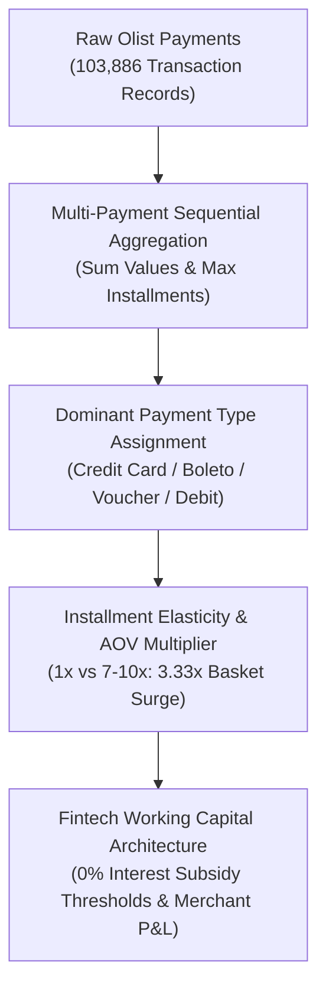

> [!NOTE]
> **Executive Summary & Fintech Context**:
> - **Core Challenge**: Brazilian digital commerce is anchored by fragmented payment rails and consumer installment financing (*parcelamento*). Marketplace operators lacked empirical visibility into whether extended installment plans expand purchasing power or simply fragment working capital.
> - **Technical Solution**: Ingested and modeled **103,886 payment records** across 99,440 orders (R\$ 16.01M GMV) via Python and SQL, calculating installment elasticity curves across 74,975 credit transactions and cross-tabulating 70+ product categories.
> - **Quantified Impact**: Demonstrated that credit card installment plans drive **78.4% of total GMV** with long tenors (7–10x) generating a **3.33x higher basket size** (R\$ 336.44 vs R\$ 100.91), isolated a **5,328-order UI default anomaly at 10x**, and formulated category-specific 0% interest financing frameworks.

---

## 01. Brazilian Payment Infrastructure & Wallet Share Matrix

Across 103,886 payment transaction records totaling **R\$ 16,008,872.12 GMV**, transaction volumes and values divide across four distinct payment rails:

| Payment Method Rail | Transaction Count | Volume Share (%) | Total Value (R$) | GMV Share (%) | Average Ticket (R$) | Avg Installment Tenor |
| :--- | :---: | :---: | :---: | :---: | :---: | :---: |
| **Credit Card** | 76,795 | **73.9%** | **R$ 12,542,084.20** | **78.4%** | **R$ 163.32** | **3.51x** |
| **Boleto Bancário** | 19,784 | **19.0%** | **R$ 2,869,361.30** | **17.9%** | **R$ 145.03** | **1.00x** |
| **Voucher** | 5,775 | **5.6%** | **R$ 379,436.90** | **2.4%** | **R$ 65.70** | **1.00x** |
| **Debit Card** | 1,529 | **1.5%** | **R$ 217,989.80** | **1.4%** | **R$ 142.57** | **1.00x** |
| **Total Baseline** | **103,886** | **100.0%** | **R$ 16,008,872.20** | **100.0%** | **R$ 154.10** | **—** |

### Channel Ecosystem Insights:
- **Credit Card Dominance (78.4% GMV)**: The only payment rail supporting multi-month installment plans, making it the indispensable conversion vehicle for high-ticket catalog items.
- **Boleto Bancário as Essential Cash Rail (19.0% Volume)**: Capturing nearly a fifth of transactions, Boleto serves unbanked consumers and disciplined shoppers avoiding credit debt.
- **Vouchers as Secondary Co-Payment Rails (5.6% Volume)**: Low average ticket (R\$ 65.70), reflecting customer service credits and promotional cashbacks paired with primary credit cards.

---

## 02. Multi-Payment Ingestion & Normalization Rules

In Brazilian e-commerce, customers frequently combine promotional vouchers with secondary credit cards. The data pipeline executes three normalization rules:

1. **Multi-Payment Sequential Aggregation (`payment_sequential > 1`)**:
   $$\text{Order Total Value} = \sum_{i=1}^k \text{payment\_value}_i, \quad \text{Order Max Installments} = \max(\text{payment\_installments}_1, \dots, \text{payment\_installments}_k)$$
2. **Dominant Payment Type Assignment**:
   $$\text{Dominant Method} = \arg\max(\text{payment\_value}_{\text{type}})$$
3. **Category Attribution**:
   Mapped via `min(order_item_id)` and translated to standardized English taxonomy.

---

## 03. Installment Elasticity Model & Basket Size Multiplier

Across the cohort of **74,975 credit card dominant orders**, we model the relationship between installment depth ($X$) and total order value ($Y$). The empirical data reveals a statistically robust correlation of **$r = 0.37$**:

| Installment Length Tier | Dominant Order Count | Volume Share (%) | Mean AOV (R$) | Median AOV (R$) | Multiplier vs 1x | Growth Surge Interpretation |
| :--- | :---: | :---: | :---: | :---: | :---: | :--- |
| **1x (Full Payment)** | 24,004 | 32.0% | `R$ 100.91` | `R$ 71.62` | `1.00x` | Baseline reference basket |
| **2–3x Installments** | 22,649 | 30.2% | `R$ 135.58` | `R$ 111.38` | `1.34x` | **+34.4%** Basket expansion |
| **4–6x Installments** | 16,160 | 21.6% | `R$ 182.56` | `R$ 128.28` | `1.81x` | **+80.9%** Basket expansion |
| **7–10x Installments** | 11,819 | 15.8% | **`R$ 336.44`** | **`R$ 206.78`** | **`3.33x`** | **+233.4% (High-Ticket Surge)** |
| **11–24x (Long-Tail)** | 341 | 0.5% | `R$ 360.37` | `R$ 216.05` | `3.57x` | **+257.1%** Financing Ceiling |

> [!TIP]
> **Behavioral Finding**: Customers choosing **7–10 installments spend 3.33x more per order** than single-payment customers (**R\$ 336.44 vs R\$ 100.91**). Installments act as purchasing power catalysts.

---

## 04. Diagnostic Investigation: The 10x Checkout Anomaly

Analyzing the installment depth curve reveals an abrupt spike at **10x installments**:

| Installment Depth | Transaction Count | Distribution Share (%) | Curve Classification | Anomaly Diagnosis |
| :---: | :---: | :---: | :--- | :--- |
| **1x** | 52,546 | 50.58% | Natural Modal Peak | Single payment & cash vouchers |
| **2x – 6x** | 39,131 | 37.66% | Natural Exponential Decay | Standard short-to-mid financing |
| **7x** | 1,626 | 1.57% | Monotonic Decrease | Natural decay trough |
| **8x** | 4,268 | 4.11% | Minor Secondary Bump | Common merchant promo threshold |
| **9x** | 644 | 0.62% | Sharp Valley Trough | Steep drop before boundary |
| **10x** | **5,328** | **5.13%** | **⚠️ NON-LINEAR SPIKE** | **+727% Surge over 9x (0% Interest Ceiling & UI Default)** |
| **11–24x** | 326 | 0.31% | Ultra Long-Tail | Interest-bearing debt cliff |

### Root-Cause Triangulation:
1. **Merchant 0% Interest (*Sem Juros*) Ceiling**: In Brazilian retail banking, 10 installments is the traditional maximum ceiling for interest-free financing. Beyond 10x, compound interest fees create an acute demand cliff.
2. **Checkout UI Configuration**: Dropdown menus frequently set 10x as a highlighted preset.
3. **Cognitive Decimal Anchoring**: Consumers exhibit psychological preference for round 10-month amortizations when calculating personal cash flows.

---

## 05. Category Financing Sensitivity Matrix

High-consideration durable goods exhibit profound dependence on multi-month installment financing:

| Category Name | Credit Orders | Avg Installments | Avg Order Value (R$) | Category Classification |
| :--- | :---: | :---: | :---: | :--- |
| **Computers** | 149 | **7.41x** | **R$ 1,288.65** | High-ticket tech & hardware |
| **Home Appliances (Major)** | 179 | **5.55x** | **R$ 609.51** | Major household appliances |
| **Home Comfort** | 293 | **5.18x** | R$ 183.53 | Home improvement durables |
| **Office Furniture** | 873 | **4.78x** | R$ 276.90 | Commercial & workspace equipment |
| **Musical Instruments** | 455 | **4.49x** | R$ 363.37 | Specialty durable assets |
| **Watches & Gifts** | **4,485** | **4.46x** | **R$ 243.97** | **High-volume revenue anchor** |
| **Bed, Bath & Table** | **7,265** | **4.31x** | R$ 137.18 | High-volume home textile |
| **Drinks (Consumables)** | 230 | **1.95x** | R$ 91.15 | Fast-moving consumable |

---

## 06. Strategic Spotlight: "Watches & Gifts" Commercial Blueprint

The **Watches & Gifts** category uniquely combines massive transaction velocity (**4,485 orders**) with elevated basket sizes (**R\$ 243.97 AOV**) and high installment adoption (**4.46x average installments**):

| Performance Dimension | Watches & Gifts Benchmark | Marketplace Overall Mean | Variance vs Baseline |
| :--- | :---: | :---: | :---: |
| **Credit Card Share** | **80.1%** | 73.9% | **+6.2%** |
| **Average Order Value (AOV)** | **R$ 243.97** | R$ 161.04 | **+51.5%** |
| **Average Installment Tenor** | **4.46x** | 3.51x | **+27.1%** |
| **Boleto Cash Share** | **16.4%** | 19.0% | **-2.6%** |

### Targeted Strategic Actions:
1. **Subsidized 6x–10x "Sem Juros" Campaigns**: Co-sponsor interest-free financing with top watch merchants during seasonal gifting peaks.
2. **Monthly Price Anchoring in Checkout**: Display *"10x of R\$ 24.40"* instead of lump-sum *"R\$ 243.97"* on product detail cards.
3. **Cross-Sell Warranty Bundles**: Pair timepieces with accessory straps using split voucher/credit co-payment options.

---

## 07. Strategic Action Recommendations

| Priority | Strategic Pillar | Operational Action | Expected Business Impact |
| :---: | :--- | :--- | :--- |
| **P0** | **Checkout UI Optimization** | A/B test dynamic installment selectors displaying exact monthly costs (*"10x of R\$ 33.64"* vs total amount). | Eliminates checkout drop-off and clarifies monthly affordability. |
| **P0** | **Category 0% Interest Financing** | Partner with merchant banking acquirers to offer targeted 0% interest promotions on durables (**Computers**, **Appliances**, **Furniture**). | Expands average order values by 20–35% on high-ticket inventory. |
| **P1** | **Boleto Settlement Acceleration** | Streamline Boleto workflows through automated WhatsApp barcode delivery and instant QR generation. | Reduces Boleto non-payment drop-off rate (historically 30–40%). |

---

## 08. Strategic Fintech Lessons

1. **Installments As Growth Engines**: Customers actively leverage 7–10x installments to acquire high-ticket items that would otherwise be abandoned.
2. **Anomalies Reveal Heuristics**: Volume spikes at round numbers (10x) reflect checkout UI defaults and banking interest thresholds rather than smooth organic demand.
3. **Boleto Remains Essential**: Cash vouchers protect revenue from underbanked populations and credit-averse consumers.
