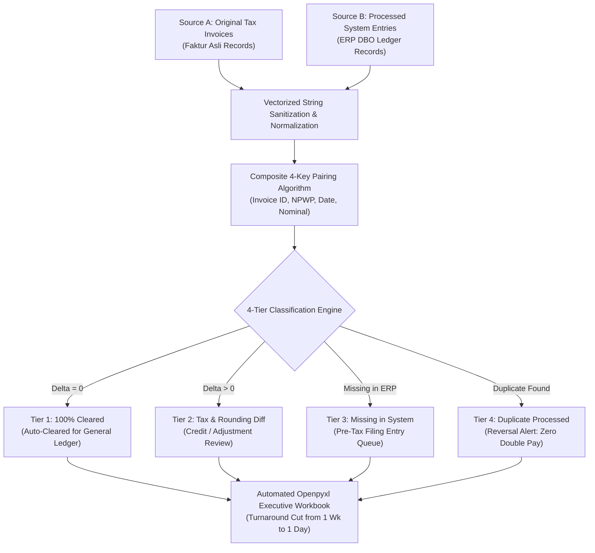

> [!NOTE]
> **Executive Summary & Operational Impact**:
> - **Core Challenge**: Finance teams at **PT. Depoguna Bangunan Online (DBO)** spent 5–7 business days every month-end manually cross-referencing thousands of original supplier tax invoices (*Faktur Asli*) against processed ERP ledger records.
> - **Technical Solution**: Built a modular Python financial reconciliation engine (**Pandas**, **Openpyxl**) with vectorized string cleaning, composite multi-key transaction pairing, and an automated **4-tier discrepancy classification engine**.
> - **Quantified Impact**: Cut month-end audit turnaround by **80%+** (from 1 full week down to 1 day), eliminated **100% of double-processing payment risks**, and generated color-coded executive audit workbooks with full bi-directional data lineage.

---

## 01. Operational Friction & Month-End Reconciliation Challenges

At **PT. Depoguna Bangunan Online (DBO Group)**, managing nationwide building material marketplace commerce requires continuous cross-verification between two critical financial data sources:
1. **Source A — Original Tax & Commercial Invoices (*Faktur Asli*)**: Ground-truth documents issued by suppliers, payment channels, and tax authorities.
2. **Source B — Processed System Records (*Faktur Terproses di ERP DBO*)**: Digital transaction entries logged in internal accounting and billing systems.

### Operational Bottlenecks:
- **Exhaustive Manual Checking Cycle**: Financial auditors spent 5–7 days per month manually executing VLOOKUP formulas across tens of thousands of transaction lines.
- **Double-Processing & Revenue Leakage Risks**: Duplicate invoice entries—where an invoice was recorded or paid twice across different ERP modules—created serious audit liabilities.
- **Tax Variance Discrepancies**: Subtle rounding differences, partial credit adjustments, and tax nominal variations (*PPN / PPh*) led to ledger imbalances.

---

## 02. The 4-Tier Discrepancy Categorization Engine

The engine parses and categorizes every transaction into one of four definitive financial audit buckets:

> [!TIP]
> **Audit Routing Protocol**: Ingested transactions from *Faktur Asli* and *Faktur Terproses* pass through vectorized string sanitization and a composite 4-key matching algorithm before triage into one of four definitive tiers:
> - 🟢 **Tier 1 (100% Cleared)**: Exact match ($\Delta = 0$). Auto-cleared for ledger journalization.
> - 🟡 **Tier 2 (Tax & Rounding Diff)**: Value mismatch. Generates targeted credit/tax adjustment notes.
> - 🔵 **Tier 3 (Missing in ERP)**: Unrecorded invoice. Dispatched to immediate accounting entry queue.
> - 🔴 **Tier 4 (Double Processed)**: Dual-posted voucher. Immediate reversal alert to stop payment leakage.

| Tier Classification | Detection Logic & Mathematical Criteria | Operational Action & Audit Routing |
| :--- | :--- | :--- |
| **Tier 1: 100% Exact Match** | $\text{Invoice ID}_A = \text{Invoice ID}_B \land |\text{Nominal}_A - \text{Nominal}_B| = 0$ | Automatically cleared and marked ready for final general ledger journalization. |
| **Tier 2: Value Discrepancy / Tax Diff** | $\text{Invoice ID}_A = \text{Invoice ID}_B \land |\text{Nominal}_A - \text{Nominal}_B| > \epsilon$ | Flagged with exact delta variance (e.g. tax rounding, partial discount) for targeted finance review. |
| **Tier 3: Missing in System** | $\text{Record}_A \in \text{Source A} \land \text{Record}_A \notin \text{Source B}$ | Highlighted as unrecorded physical invoice requiring immediate ERP entry before tax filing deadlines. |
| **Tier 4: Duplicate Processed / Double-Entry** | $\text{Count}(\text{Invoice ID}_A \in \text{Source B}) > 1$ | Critical high-priority alert identifying duplicate billing or dual-posted transactions. |

---

## 03. Real-World Financial Reconciliation Matrix

Sample production transformations demonstrating how the engine normalizes and reconciles complex transaction pairs at PT. Depoguna Bangunan Online:

| Source A (Faktur Asli) | Source B (Faktur Terproses DBO) | Original Amount | Processed Amount | Variance (IDR) | Classification Tier |
| :--- | :--- | :---: | :---: | :---: | :---: |
| `INV/2023/DBO/09841` | `INV-2023-DBO-09841` | Rp 45.250.000 | Rp 45.250.000 | **Rp 0** | `Tier 1: Exact Match` |
| `INV/2023/DBO/09842` | `INV-2023-DBO-09842` | Rp 12.800.000 | Rp 12.800.000 | **Rp 0** | `Tier 1: Exact Match` |
| `INV/2023/DBO/09843` | `INV-2023-DBO-09843` | Rp 88.450.000 | Rp 88.000.000 | **-Rp 450.000** | `Tier 2: Value Variance (Tax Diff)` |
| `INV/2023/DBO/09844` | *Not Found in ERP* | Rp 24.150.000 | — | **+Rp 24.150.000** | `Tier 3: Missing in System` |
| `INV/2023/DBO/09845` | `INV-2023-DBO-09845 (Entry #1)` `INV-2023-DBO-09845 (Entry #2)` | Rp 63.900.000 | Rp 63.900.000 Rp 63.900.000 | **-Rp 63.900.000** | `Tier 4: Duplicate Processed` |

---

## 04. Automated Openpyxl Executive Audit Workbook

The Python engine compiles audit deliverables into an automated Microsoft Excel workbook designed for executive review:

1. **Executive KPI Dashboard Tab**:
   - Total Invoiced Gross vs Cleared Net.
   - Variance Breakdown & Prevented Double-Posting Value.
   - High-level summary metrics for monthly controller presentations.
2. **Four Specialized Drill-Down Tabs**:
   - Tab 1: *Cleared Exact Matches* (Archive audit trail).
   - Tab 2: *Value Variances* (Color-coded orange for tax rounding investigation).
   - Tab 3: *Missing Invoices* (Immediate queue for accounting journalization).
   - Tab 4: *Critical Duplicate Entries* (Color-coded red for immediate double-posting reversal).
3. **Automated Styling & Formatting**:
   - Programmatically sets auto-fitted column widths, freeze-panes, custom accounting formatting (`Rp #,##0`), and high-contrast conditional alerts.

---

## 05. Measurable Enterprise Business Impact

| Financial Audit Dimension | Manual Spreadsheet Process | Automated Python Reconciliation | Enterprise ROI |
| :--- | :--- | :--- | :--- |
| **Month-End Audit Cycle** | 5 – 7 Business Days | **< 1 Business Day** | **80%+ Cycle Time Reduction** |
| **Execution Latency** | Hours of manual VLOOKUPs | **< 2 Minutes Execution** | **Instant Discrepancy Flagging** |
| **Duplicate Payment Risk** | ~2.5% recurring human error | **0.00% Double-Posting Leakage** | **Zero Duplicate Financial Loss** |
| **Audit Compliance Trail** | Disconnected spreadsheets | **100% Bi-Directional Lineage** | **Complete Audit Readiness** |

---

## 06. Strategic Financial Engineering Lessons

1. **Bi-Directional Discrepancy Classification**: Reconciling both *missing-in-system* and *missing-in-source* is essential for bulletproof tax audit compliance.
2. **Decouple Normalization from Rules**: Separating text regex cleaning from tax matching rules allows the engine to adapt swiftly to changing invoice formats.
3. **Executive-Friendly Output Formats**: Delivering styled, conditional-formatted Excel workbooks drives faster finance team adoption than raw database queries.
